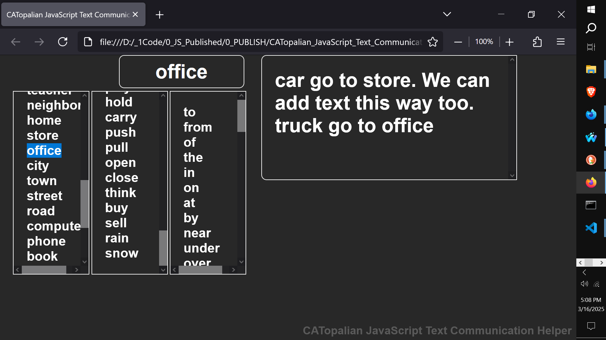

# CATopalian JavaScript Text Communication Helper
A JavaScript app that helps people to form sentences by clicking on words in a list to make communication easier.

Video: https://youtu.be/AO7Tt8xDmSA

Use App Here: https://christopherandrewtopalian.github.io/CATopalian_JavaScript_Text_Communication_Helper/CATopalian_JavaScript_Text_Communication_Helper.html

---

### How to Download this App
1. Click the green Code Button on this github page
2. Choose Download ZIP
3. Save the Zip File
4. Extract All
5. Double click the HTML file to start the App

---

Happy Scripting :-)